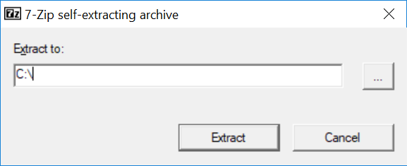
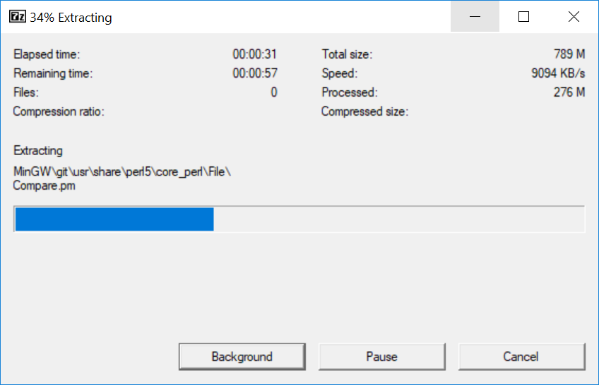

# Инструменты для разработки

Примеры и задания этой главы вы можете запускать на любой современной операционной системе: Windows, MacOS или Linux. Инструменты для разработки на Bash доступны под каждую из них. Для программирования на этом языке нам понадобится всего две вещи: его [**интерпретатор**](https://ru.wikipedia.org/wiki/%D0%98%D0%BD%D1%82%D0%B5%D1%80%D0%BF%D1%80%D0%B5%D1%82%D0%B0%D1%82%D0%BE%D1%80) и [редактор исходного кода](https://ru.wikipedia.org/wiki/%D0%A0%D0%B5%D0%B4%D0%B0%D0%BA%D1%82%D0%BE%D1%80_%D0%B8%D1%81%D1%85%D0%BE%D0%B4%D0%BD%D0%BE%D0%B3%D0%BE_%D0%BA%D0%BE%D0%B4%D0%B0). Рассмотрим их подробнее.

## Память компьютера

Любая компьютерная программа исполняется [центральным процессором](https://ru.wikipedia.org/wiki/%D0%A6%D0%B5%D0%BD%D1%82%D1%80%D0%B0%D0%BB%D1%8C%D0%BD%D1%8B%D0%B9_%D0%BF%D1%80%D0%BE%D1%86%D0%B5%D1%81%D1%81%D0%BE%D1%80) (CPU). Как мы уже знаем, программа хранится на диске в виде файла и при запуске ОС загружает её в оперативную память. Зачем это нужно? Почему нельзя просто исполнить файл на диске?

В современном компьютере есть [несколько уровней памяти](https://ru.wikipedia.org/wiki/%D0%98%D0%B5%D1%80%D0%B0%D1%80%D1%85%D0%B8%D1%8F_%D0%BF%D0%B0%D0%BC%D1%8F%D1%82%D0%B8) (см таблицу 1-1). Они отличаются друг от друга скоростью доступа. Кроме того сами устройства памяти значительно разнятся по стоимости.

_**Таблица 1-1.** Уровни памяти персонального компьютера_

| Уровень | Память | Объём | Скорость доступа | Время доступа
| --- | --- | --- | --- |
| 1 | Внутренняя память процессора ([**регистры**](https://ru.wikipedia.org/wiki/%D0%A0%D0%B5%D0%B3%D0%B8%D1%81%D1%82%D1%80_%D0%BF%D1%80%D0%BE%D1%86%D0%B5%D1%81%D1%81%D0%BE%D1%80%D0%B0) и [**кэш**](https://ru.wikipedia.org/wiki/%D0%9A%D1%8D%D1%88_%D0%BF%D1%80%D0%BE%D1%86%D0%B5%D1%81%D1%81%D0%BE%D1%80%D0%B0)). | от одного килобайта до нескольких мегабайтов | от 700 до 100 гигабайт/сек | от 1 до 100 |
| 2 | Оперативная память (RAM) | десятки гигабайтов | 10 гигабайт/сек | до 1000 |
| 3 | Дисковая память ([**жёсткие диски**](https://ru.wikipedia.org/wiki/%D0%96%D1%91%D1%81%D1%82%D0%BA%D0%B8%D0%B9_%D0%B4%D0%B8%D1%81%D0%BA), [**твёрдотельные накопители**](https://ru.wikipedia.org/wiki/%D0%A2%D0%B2%D0%B5%D1%80%D0%B4%D0%BE%D1%82%D0%B5%D0%BB%D1%8C%D0%BD%D1%8B%D0%B9_%D0%BD%D0%B0%D0%BA%D0%BE%D0%BF%D0%B8%D1%82%D0%B5%D0%BB%D1%8C)) | терабайты | 2000 мегабайт/сек | до 10000000 |

Таблица 1-1 вызывает вопросы. Разве скорости доступа к данным в 2000 Мб/с недостаточно для чтения и исполнения файла приложения размером с десятки мегабайт? На самом деле важна не столько скорость чтения данных в байтах, а то как долго простаивает процессор, дожидаясь доступа к ним. Это время доступа к памяти измеряется в числе [тактовых сигналов](https://ru.wikipedia.org/wiki/%D0%A2%D0%B0%D0%BA%D1%82%D0%BE%D0%B2%D1%8B%D0%B9_%D1%81%D0%B8%D0%B3%D0%BD%D0%B0%D0%BB) или тактах. Такт синхронизирует выполнение всех операций процессора. Как правило, элементарная операция занимает от одного до нескольких тактов.

Итак, если бы процессору приходилось читать код программы с жесткого диска и записывать на него промежуточные данные и результаты, выполнение простейших алгоритмов заняло бы в лучшем случае недели. Причём большую часть этого времени процессор простаивал бы, находясь в ожидании выполнения операций чтения и записи. Иерархическая организация памяти позволяет решить проблему простаивания процессора.

Обратите внимание, что чем меньше время доступа к памяти, тем ближе она физически расположена к процессору. Наример, внутренняя память CPU находится внутри его кристалла. Оперативная память расположена на [**материнской плате**](https://ru.wikipedia.org/wiki/Материнская_плата) рядом с процессором и соединена с ним по высокочастотной [**шине данных**](https://ru.wikipedia.org/wiki/Шина_данных). Дисковая память подключается к материнской плате через относительно медленную шину данных.

## Машинный и исходный код

В исполняемом файле приложения хранится [**машинный код**](https://ru.wikipedia.org/wiki/%D0%9C%D0%B0%D1%88%D0%B8%D0%BD%D0%BD%D1%8B%D0%B9_%D0%BA%D0%BE%D0%B4). Он представляет собой инструкции процессора, которые могут быть исполнены его логическими блоками. Каждая такая инструкция представляет собой элементарную операцию над данными, хранящимися в регистрах или кэше CPU, т.е. его внутренней памяти.

Если вы откроете исполняемый файл в редакторе, то увидите [двоичный код](https://ru.wikipedia.org/wiki/%D0%94%D0%B2%D0%BE%D0%B8%D1%87%D0%BD%D1%8B%D0%B9_%D0%BA%D0%BE%D0%B4#%D0%9F%D1%80%D0%B8%D0%BC%D0%B5%D1%80_%C2%AB%D0%B4%D0%BE%D0%B8%D1%81%D1%82%D0%BE%D1%80%D0%B8%D1%87%D0%B5%D1%81%D0%BA%D0%BE%D0%B3%D0%BE%C2%BB_%D0%B8%D1%81%D0%BF%D0%BE%D0%BB%D1%8C%D0%B7%D0%BE%D0%B2%D0%B0%D0%BD%D0%B8%D1%8F_%D0%BA%D0%BE%D0%B4%D0%BE%D0%B2). Именно в таком формате процессор принимает свои инструкции. Очевидно, для человека писать программу в двоичных кодах очень трудоёмко. Поэтому появились [**компиляторы**](https://ru.wikipedia.org/wiki/%D0%9A%D0%BE%D0%BC%D0%BF%D0%B8%D0%BB%D1%8F%D1%82%D0%BE%D1%80) и [**интерпретаторы**](https://ru.wikipedia.org/wiki/%D0%98%D0%BD%D1%82%D0%B5%D1%80%D0%BF%D1%80%D0%B5%D1%82%D0%B0%D1%82%D0%BE%D1%80#%D0%98%D1%81%D1%82%D0%BE%D1%80%D0%B8%D1%8F).

Идея интерпретаторов заключается в том, чтобы читать команды программы из файла построчно и сразу же отправлять их процессору для исполнения. То есть можно сказать, что интерпретатор — это программа, которая переводит команды программы на "язык" процессора.

Текст приложения пишется на каком-то [языке программирования](https://ru.wikipedia.org/wiki/%D0%AF%D0%B7%D1%8B%D0%BA_%D0%BF%D1%80%D0%BE%D0%B3%D1%80%D0%B0%D0%BC%D0%BC%D0%B8%D1%80%D0%BE%D0%B2%D0%B0%D0%BD%D0%B8%D1%8F), отличном от двоичного кода процессорных инструкций. Этот текст называется [**исходным кодом**](https://ru.wikipedia.org/wiki/%D0%98%D1%81%D1%85%D0%BE%D0%B4%D0%BD%D1%8B%D0%B9_%D0%BA%D0%BE%D0%B4). Интерпретатор читает исходный код из файла на диске и исполняет указанные в нём команды друг за другом.

Очевидно, процесс интерпретации значительно замедляет работу приложения. Вместо его непосредственного исполнения на процессоре, появляется программа-посредник. Получается, что компьютер должен предоставлять ресурсы не только вашему приложению, но и его интерпретатору. Однако, эта плата за удобство разработки программ зачастую приемлема. Как правило, язык программирования намного удобнее и выразительнее двоичного кода. Благодаря чему, написанные на нём программы намного проще (а значит и дешевле) разрабатывать и поддерживать.

## Установка интерпретатора Bash

Интерпретатор Bash входит в набор инструментов [**MinGW**](https://nuwen.net/mingw.html). Этот набор включает в себя пользовательские компоненты GNU и [свободный набор компиляторов GCC](https://ru.wikipedia.org/wiki/GNU_Compiler_Collection).

Чтобы установить MinGW на свой компьютер, выполните следующие действия:

1. Скачайте самораспаковывающийся архив с набором инструментов. Это должен быть файл с именем `mingw-16.1.exe`. Число 16.1 в имени файла означает номер актуальной версии.

2. Запустите скачанный архив. Откроется диалог распаковки, как на иллюстрации 1-1.

_**Иллюстрация 1-1.** Диалог распаковки MinGW_

3. В диалоге выберите путь установки и нажмите кнопку "Extract" (извлечь). Откроется диалог с текущим состоянием распаковки файлов MinGW, как на иллюстрации 1-2.

_**Иллюстрация 1-2.** Процесс установки MinGW_

После завершения процесса установки диалог закроется автоматически. По указанному вами пути будут находится файлы MinGW.

// TODO: Дать инструкцию установки MinGW под Windows. Указать, что Bash по умолчанию доступен на MacOs и Linux.

// TODO: Дать инструкцию запуска интерпретатора командной строки.

## Редактор исходного кода

// TODO: Дать перечень редакторов с обзором их возможностей.

// TOOD: Дать инструкцию по установке.